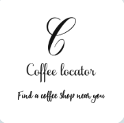
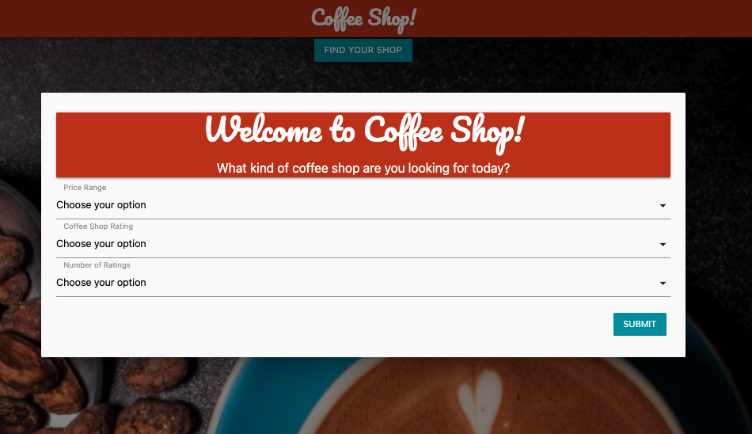
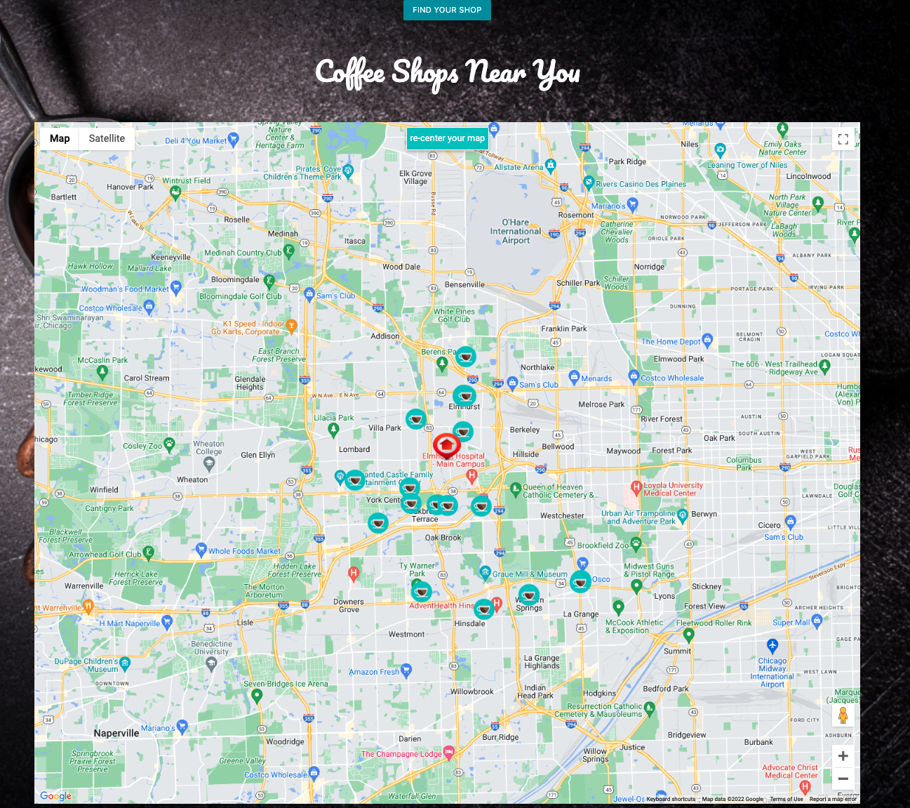
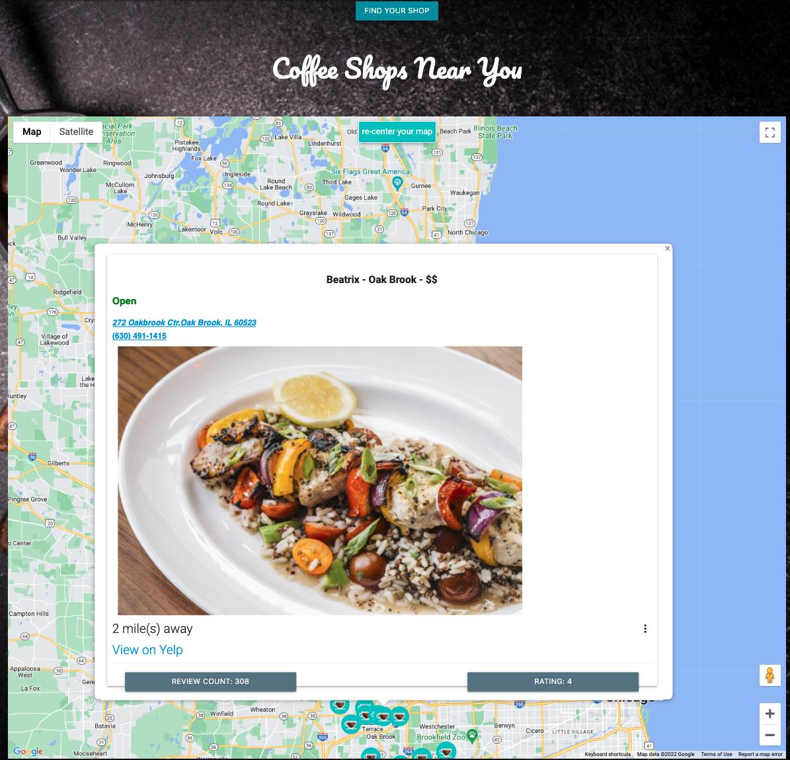
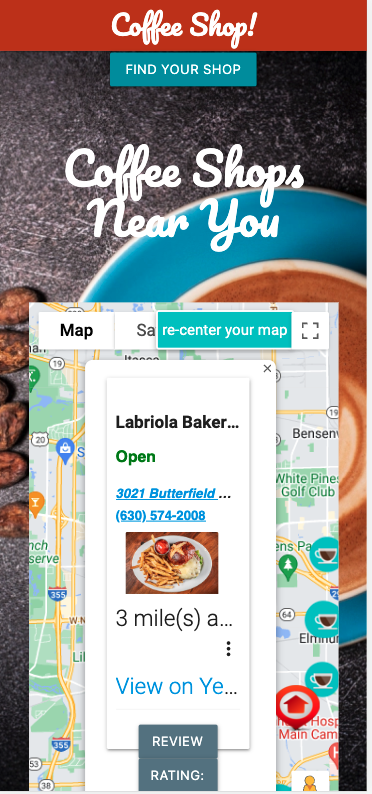

# 

# Coffee Shop

<table>
<tr>
<td>
  Have you ever wanted to find a coffee shop near you either for a delicious cup of coffee or for a change in scenery while you do this work-from-home thing? Our Coffee Locator app is the tool for you. With just a few clicks, you can narrow down your choices and be at the shop in no time. The app connects with some of our most trusted search engines like Google Maps and Yelp for reliability and consistency in features. Coffee Locator is provided as a web app, no install necessary, just save a shortcut on your mobile or desktop device and you are well on your way to great satisfaction. 
</td>
</tr>
</table>

## Demo

To view this web app: https://p1-coffeework.github.io/coffeeLocator/

## Site

### Landing Page

The app automatically detects your location and provides the top shops closest to you. Yes, that means you have to allow location access when you get that friendly popup.

### Customizing your search

Pick all or some of the filters provided to customize your search. Do you want a shop with high ratings and reviews? You can do it here. If not, no problem, just click Submit on the modal and get going.

### The Map

Your modal leads you to a map that shows cups of coffee markers uniquely positioned on a map for you and you alone. Need more info to make your decision, no problem. Click a cup and you are given all the details you need. If you are already convinced, but need contact information, click that cup. If you are just want to know about coffee shops in your area, keep clicking away. There's no end to that game :-). The info window also provides lines to Yelp and Google Navigation if you need additional services. You could also just click on the phone number to make a direct call.

## Mobile support

This app is compatible with all modern devices and web browsers of all sizes. It is what we describe as responsive!

### Development

This app was built collaboratively as a first-project by a team of students from the Northwestern University Coding boot camp.

Technologies used:

- JavaScript
- Materialize CSS
- JQuery
- HTML
- Google Maps API
- Yelp API

## Future enhancements

- Tap into more API services that provide details on WIFI, occupancy levels and parking.
- Provide recipes for in-house coffee enjoyment
- Use traffic patterns as part of our rating system
